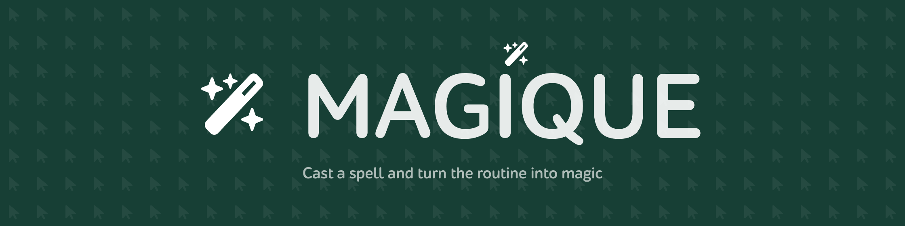

# magique.py

That's my expirement, being in development from my personal programming language called MagiqueScript
with some features, I'm going to implement there

1. Declarative constructions. Most of UI Automation tools are strictly imperative. The special tools like `when()`
and `observable()` and some event-based features will be added
2. built-in declarative variables for cursor, keyboard states, OS parameters, indicators, etc.
3. Remote scripting. Every computer with `magique.py` can be both a client and a server, to perform scripts in local
or remote machines as you want (like Ansible, but in UI)
4. Parallel execution. Like Remote Scripting, but your actions will be applied to other machines where you want
to perform the same actions in real time
5. Multi-Monitor support
6. Easy to start, `pip install magique`, `import magique` and you're ready to go
7. Fully cross-platform code, able to start on windows, linux, and macOS without special hard-working
8. WinDriver, Selenium, Playwright included for wide variety of options of automation
9. Action recorder - a simple code generator
10. Voice commands, recognition and command builder with the same Declarative hooks as keys, mouse, etc.
11. (optional) Gamepad support (at least, XBox controllers)

It will be great if the solution will be suitable for multiple PC in-home automation, able to be
integrated into any device (one of target is being cross-platform)